## Project: 3D Motion Planning
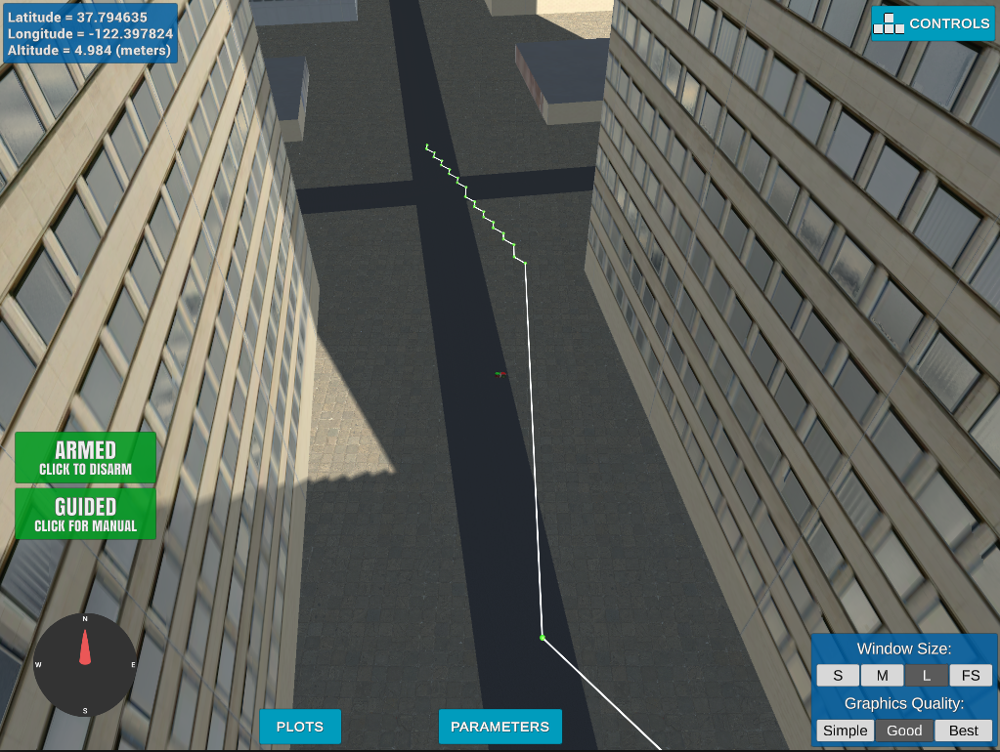
In this project,I have developed an algorithm for 3D motion planning. To perform the motion planning, the destination location is given in GPS coordinates. The motion planning algorithm estimates the waypoints using A* algorithm, optimizes it, and then executes the plan to make the drone reach the destination location.

The following section explains the various steps I followed to develop this algorithm.

### Motion Planning Vs Backyard Flyer
The motion planning project is the extension of the backyard flyer project. In the backyard flyer, waypoints are fixed and given is a list, where as in motion planning, the goal position is ten meters away from the origin in both north and east direction. The backyard flyer project calculates the waypoints to the goal position using A* algorithm, but waypoints are directly mentioned in the backyard flyer.

###Extracting lat0 and lon0

The motion planning algorithm uses the discretized 2.5D map given in the colliders.csv file. The discretized map must align with the simulation environment to make the algorithm work properly. So the global home is set to the original location given in the colliders.csv file.
The following code segment shows how the global home is set with the 2.5D map file's origin. 
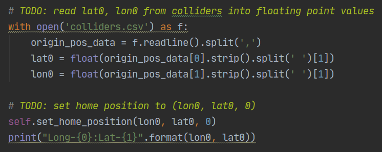

### Takeoff the Drone From Anywhere
By default, The drone always takeoff from the map origin. To make the drone take off from anywhere, I have set the starting location to the current global location. In the first step, the global location is converted into local coordinates, and then it is mapped to grid location. 
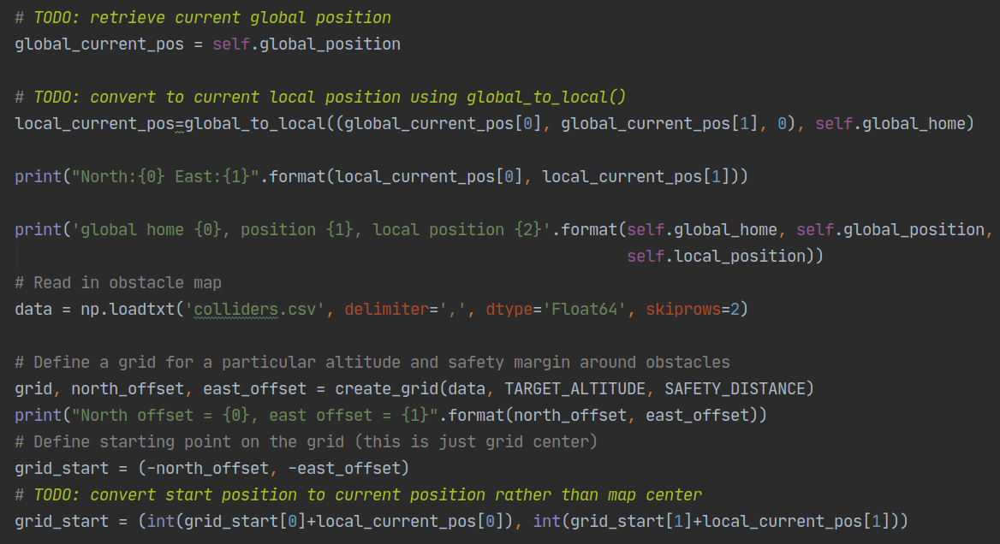

### Changing the Start Location
Starting location is changed to the current location, by setting the variable grid_start.
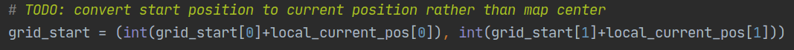

### Setting the Goal Location
The flight plan's goal location needs to be mentioned in the GPS coordinate system, but the planning algorithm understands only the map coordinates. GPS coordinates give more flexibility to the user. The goal GPS coordinates are first converted into local coordinates, and then it is converted into map coordinates.
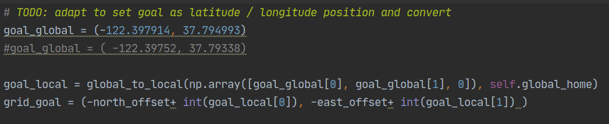
### Modified A* implementation
I use the A* algorithm to find the path from the start location to the goal location. I have added diagonal motion on the grid to improve the planning. 

Adding the diagonal motion introduces four more actions into the Action class. The cost of the diagonal is taken as sqrt(2).
 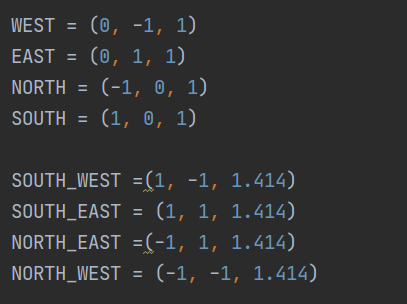

Valid_actions method is modified to check the diagonal directions. Grid out of range is checked by the following code snippet.
 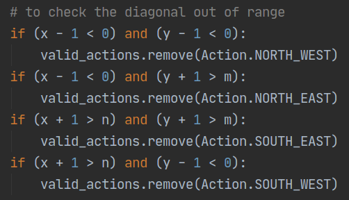
 
 The following code checks the obstacles in the diagonal direction and removes the valid actions accordingly.
  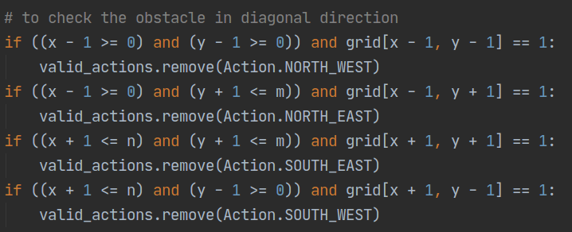
  
### Collinearity Test
Collinearity check is done on the flight plan generated from the A* algorithm. Collinearity check removes the unwanted intermediate waypoints and makes the drone fly smoothly. 
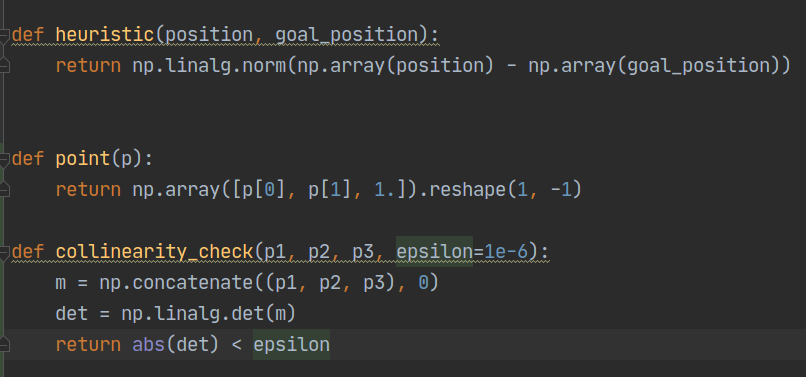
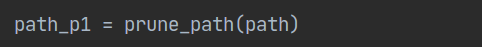

##### Waypoints Before Linearity Check
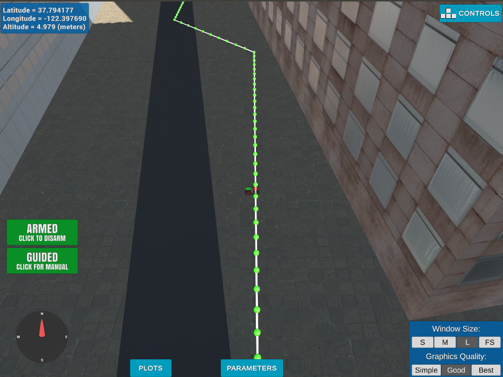

##### Waypoints After Linearity Check 
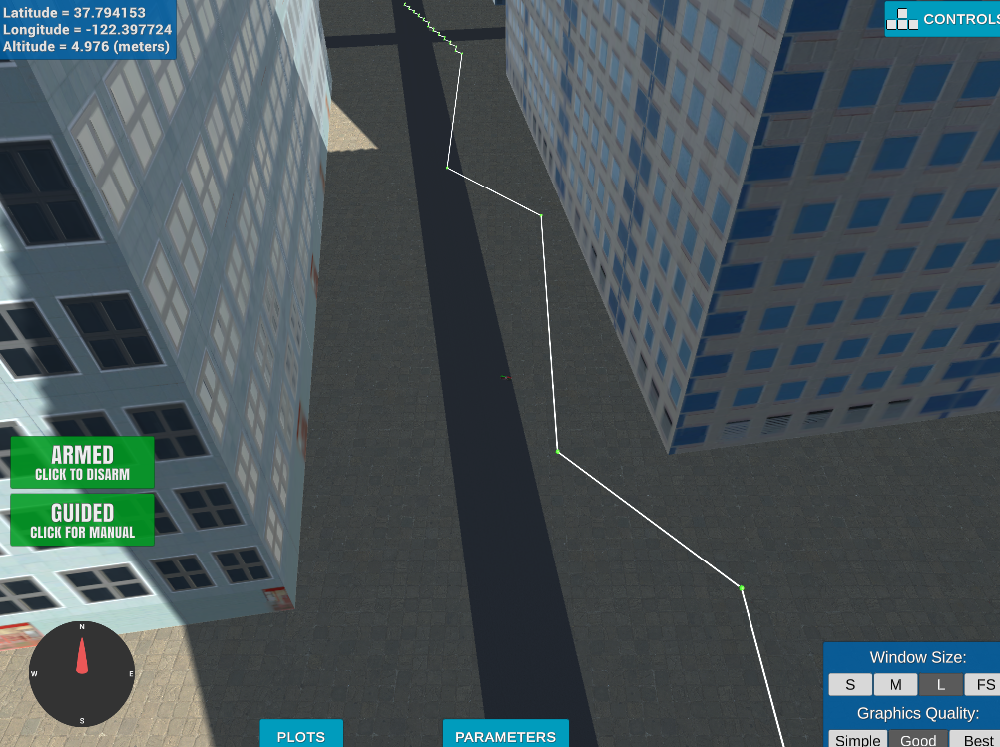

After introducing the linearity check, the drone flies smooth and fast.

